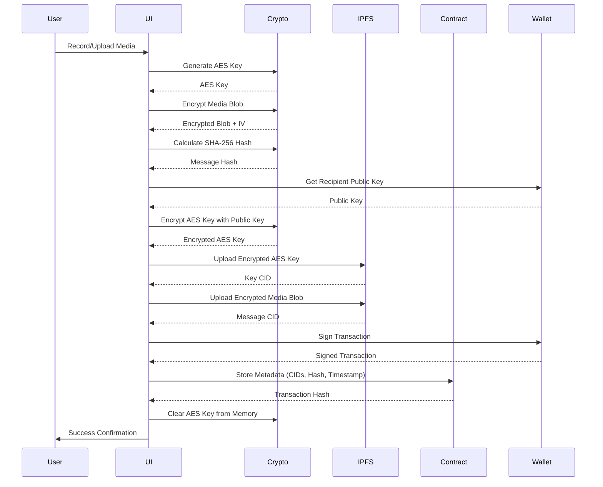
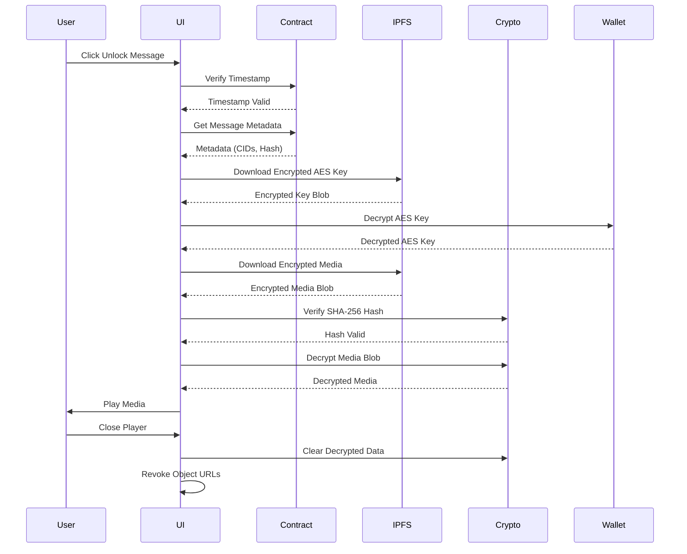

# Lockdrop Developer Guide

## Table of Contents

1. [Architecture Overview](#architecture-overview)
2. [API Reference](#api-reference)
3. [Smart Contract ABI](#smart-contract-abi)
4. [Encryption Flow](#encryption-flow)
5. [Key Conversion](#key-conversion)
6. [Testing Guide](#testing-guide)
7. [Deployment Guide](#deployment-guide)
8. [Troubleshooting](#troubleshooting)

## Architecture Overview

Lockdrop follows a modular architecture with clear separation of concerns:

```
┌─────────────────────────────────────────────────────────────┐
│                     Client-Side Only                         │
│                                                              │
│  ┌────────────────────────────────────────────────────────┐ │
│  │                   UI Layer (React)                      │ │
│  │  - Components (wallet, media, dashboard, unlock)       │ │
│  │  - Pages (App Router)                                  │ │
│  │  - Hooks (useWallet, useMediaRecorder, etc.)          │ │
│  └────────────────────────────────────────────────────────┘ │
│                            │                                 │
│  ┌────────────────────────────────────────────────────────┐ │
│  │                 Service Layer (lib/)                    │ │
│  │  - CryptoService: Encryption/decryption               │ │
│  │  - IPFSService: Storage operations                    │ │
│  │  - ContractService: Blockchain interactions           │ │
│  │  - UnlockService: Message unlocking logic             │ │
│  └────────────────────────────────────────────────────────┘ │
│                            │                                 │
│  ┌────────────────────────────────────────────────────────┐ │
│  │              External APIs (Browser/Web)                │ │
│  │  - Web Crypto API                                      │ │
│  │  - MediaRecorder API                                   │ │
│  │  - Talisman Extension API                             │ │
│  └────────────────────────────────────────────────────────┘ │
└─────────────────────────────────────────────────────────────┘
                            │
        ┌───────────────────┼───────────────────┐
        │                   │                   │
        ▼                   ▼                   ▼
┌──────────────┐    ┌──────────────┐    ┌──────────────┐
│ Web3.Storage │    │   Polkadot   │    │   Talisman   │
│   (IPFS)     │    │   Westend    │    │    Wallet    │
└──────────────┘    └──────────────┘    └──────────────┘
```

### Design Principles

1. **Privacy First**: All sensitive operations happen client-side
2. **Zero Trust**: No server or third party can access plaintext content
3. **Modular**: Clear separation between UI, business logic, and external services
4. **Type Safe**: Comprehensive TypeScript types for all interfaces
5. **Error Resilient**: Retry logic and fallbacks for network operations


## API Reference

### CryptoService

Located in `lib/crypto/CryptoService.ts`

#### `generateKey(): Promise<CryptoKey>`

Generates a unique AES-256-GCM encryption key.

**Returns**: `Promise<CryptoKey>` - A CryptoKey object for AES-GCM encryption

**Example**:
```typescript
const key = await CryptoService.generateKey();
```

**Requirements**: 4.1

---

#### `encryptBlob(blob: Blob, key: CryptoKey): Promise<EncryptedData>`

Encrypts a media blob using AES-256-GCM.

**Parameters**:
- `blob: Blob` - The media file to encrypt
- `key: CryptoKey` - The AES key generated by `generateKey()`

**Returns**: `Promise<EncryptedData>` - Object containing ciphertext and IV

**Example**:
```typescript
const encrypted = await CryptoService.encryptBlob(mediaBlob, key);
// encrypted = { ciphertext: ArrayBuffer, iv: Uint8Array }
```

**Requirements**: 4.2, 4.3

---

#### `decryptBlob(encryptedData: EncryptedData, key: CryptoKey): Promise<Blob>`

Decrypts an encrypted blob back to its original form.

**Parameters**:
- `encryptedData: EncryptedData` - The encrypted data with IV
- `key: CryptoKey` - The AES key used for encryption

**Returns**: `Promise<Blob>` - The decrypted media blob

**Example**:
```typescript
const decryptedBlob = await CryptoService.decryptBlob(encrypted, key);
```

**Requirements**: 10.1

---

#### `exportKey(key: CryptoKey): Promise<ArrayBuffer>`

Exports a CryptoKey to raw format for storage/transmission.

**Parameters**:
- `key: CryptoKey` - The key to export

**Returns**: `Promise<ArrayBuffer>` - Raw key bytes

**Example**:
```typescript
const rawKey = await CryptoService.exportKey(key);
```

---

#### `importKey(rawKey: ArrayBuffer): Promise<CryptoKey>`

Imports a raw key back to CryptoKey format.

**Parameters**:
- `rawKey: ArrayBuffer` - Raw key bytes

**Returns**: `Promise<CryptoKey>` - Imported CryptoKey

**Example**:
```typescript
const key = await CryptoService.importKey(rawKey);
```


### AsymmetricCrypto

Located in `lib/crypto/AsymmetricCrypto.ts`

#### `encryptKey(aesKey: CryptoKey, recipientPublicKey: string): Promise<ArrayBuffer>`

Encrypts an AES key with the recipient's public key using RSA-OAEP.

**Parameters**:
- `aesKey: CryptoKey` - The AES key to encrypt
- `recipientPublicKey: string` - Recipient's public key (hex or base64)

**Returns**: `Promise<ArrayBuffer>` - Encrypted key bytes

**Example**:
```typescript
const encryptedKey = await AsymmetricCrypto.encryptKey(aesKey, recipientPubKey);
```

**Requirements**: 4.5, 6.1

---

#### `decryptKey(encryptedKey: ArrayBuffer, wallet: InjectedAccount): Promise<CryptoKey>`

Decrypts an AES key using the recipient's private key via Talisman wallet.

**Parameters**:
- `encryptedKey: ArrayBuffer` - The encrypted AES key
- `wallet: InjectedAccount` - Talisman wallet account

**Returns**: `Promise<CryptoKey>` - Decrypted AES key

**Example**:
```typescript
const aesKey = await AsymmetricCrypto.decryptKey(encryptedKey, walletAccount);
```

**Requirements**: 9.4, 9.5

---

### IPFSService

Located in `lib/storage/IPFSService.ts`

#### `upload(blob: Blob, options?: UploadOptions): Promise<string>`

Uploads a blob to IPFS via Web3.Storage with automatic fallback to Pinata.

**Parameters**:
- `blob: Blob` - The file to upload
- `options?: UploadOptions` - Optional configuration
  - `onProgress?: (progress: number) => void` - Progress callback (0-100)
  - `chunked?: boolean` - Use chunked upload for large files
  - `chunkSize?: number` - Chunk size in bytes (default: 50MB)

**Returns**: `Promise<string>` - IPFS CID

**Example**:
```typescript
const cid = await IPFSService.upload(encryptedBlob, {
  onProgress: (progress) => console.log(`${progress}% uploaded`),
  chunked: blob.size > 50 * 1024 * 1024
});
```

**Requirements**: 5.1, 5.2, 5.4

---

#### `download(cid: string): Promise<Blob>`

Downloads a blob from IPFS using the CID.

**Parameters**:
- `cid: string` - IPFS Content Identifier

**Returns**: `Promise<Blob>` - Downloaded file

**Example**:
```typescript
const blob = await IPFSService.download('bafybeig...');
```

**Requirements**: 9.5

---

### ContractService

Located in `lib/contract/ContractService.ts`

#### `storeMessage(metadata: MessageMetadata, signer: InjectedAccount): Promise<string>`

Stores message metadata on the Polkadot smart contract.

**Parameters**:
- `metadata: MessageMetadata` - Message metadata object
- `signer: InjectedAccount` - Talisman wallet account for signing

**Returns**: `Promise<string>` - Transaction hash

**Example**:
```typescript
const txHash = await ContractService.storeMessage({
  encryptedKeyCID: 'bafybeig...',
  encryptedMessageCID: 'bafybeih...',
  messageHash: '0x123...',
  unlockTimestamp: 1735689600,
  recipient: '5GrwvaEF...'
}, walletAccount);
```

**Requirements**: 6.1, 6.2, 6.3

---

#### `getSentMessages(address: string): Promise<Message[]>`

Queries sent messages for a given address.

**Parameters**:
- `address: string` - Sender's Polkadot address

**Returns**: `Promise<Message[]>` - Array of sent messages

**Example**:
```typescript
const sentMessages = await ContractService.getSentMessages('5GrwvaEF...');
```

**Requirements**: 7.1

---

#### `getReceivedMessages(address: string): Promise<Message[]>`

Queries received messages for a given address.

**Parameters**:
- `address: string` - Recipient's Polkadot address

**Returns**: `Promise<Message[]>` - Array of received messages

**Example**:
```typescript
const receivedMessages = await ContractService.getReceivedMessages('5GrwvaEF...');
```

**Requirements**: 8.1


### UnlockService

Located in `lib/unlock/UnlockService.ts`

#### `unlockMessage(message: Message, wallet: InjectedAccount): Promise<Blob>`

Unlocks and decrypts a time-locked message.

**Parameters**:
- `message: Message` - Message object from blockchain
- `wallet: InjectedAccount` - Recipient's wallet account

**Returns**: `Promise<Blob>` - Decrypted media blob

**Example**:
```typescript
const decryptedMedia = await UnlockService.unlockMessage(message, walletAccount);
```

**Requirements**: 9.1, 9.2, 9.4, 9.5, 9.6, 10.1

---

### RedeemPackageService

Located in `lib/redeem/RedeemPackageService.ts`

#### `createRedeemPackage(aesKey: CryptoKey, metadata: MessageMetadata, passphrase: string): Promise<RedeemPackage>`

Creates a redeem package for recipients without wallets.

**Parameters**:
- `aesKey: CryptoKey` - The AES key for the message
- `metadata: MessageMetadata` - Message metadata
- `passphrase: string` - User-provided passphrase for protection

**Returns**: `Promise<RedeemPackage>` - Redeem package with CID

**Example**:
```typescript
const redeemPackage = await RedeemPackageService.createRedeemPackage(
  aesKey,
  metadata,
  'my-secure-passphrase-123'
);
```

**Requirements**: 6.6

---

#### `claimRedeemPackage(packageCID: string, passphrase: string): Promise<ClaimedPackage>`

Claims a redeem package using the passphrase.

**Parameters**:
- `packageCID: string` - IPFS CID of the redeem package
- `passphrase: string` - Passphrase provided by sender

**Returns**: `Promise<ClaimedPackage>` - Decrypted package contents

**Example**:
```typescript
const claimed = await RedeemPackageService.claimRedeemPackage(
  'bafybeig...',
  'my-secure-passphrase-123'
);
```

**Requirements**: 6.6


## Smart Contract ABI

### Contract Interface

The Lockdrop smart contract is written in ink! and deployed on Polkadot Westend testnet.

#### Storage Structure

```rust
pub struct MessageMetadata {
    pub encrypted_key_cid: String,
    pub encrypted_message_cid: String,
    pub message_hash: String,
    pub unlock_timestamp: u64,
    pub sender: AccountId,
    pub recipient: AccountId,
    pub created_at: u64,
}
```

#### Contract Methods

##### `store_message`

Stores a new time-locked message on-chain.

**Signature**:
```rust
#[ink(message)]
pub fn store_message(
    &mut self,
    encrypted_key_cid: String,
    encrypted_message_cid: String,
    message_hash: String,
    unlock_timestamp: u64,
    recipient: AccountId,
) -> Result<MessageId, Error>
```

**Parameters**:
- `encrypted_key_cid`: IPFS CID of the encrypted AES key
- `encrypted_message_cid`: IPFS CID of the encrypted media blob
- `message_hash`: SHA-256 hash of the encrypted media (for integrity verification)
- `unlock_timestamp`: Unix timestamp when message becomes unlockable
- `recipient`: Polkadot address of the recipient

**Returns**: `MessageId` - Unique identifier for the stored message

**Errors**:
- `InvalidTimestamp`: Unlock timestamp is in the past
- `InvalidCID`: CID format is invalid
- `StorageFull`: Contract storage limit reached

---

##### `get_sent_messages`

Retrieves all messages sent by a specific address.

**Signature**:
```rust
#[ink(message)]
pub fn get_sent_messages(
    &self,
    sender: AccountId
) -> Vec<MessageMetadata>
```

**Parameters**:
- `sender`: Polkadot address of the sender

**Returns**: `Vec<MessageMetadata>` - Array of message metadata

---

##### `get_received_messages`

Retrieves all messages received by a specific address.

**Signature**:
```rust
#[ink(message)]
pub fn get_received_messages(
    &self,
    recipient: AccountId
) -> Vec<MessageMetadata>
```

**Parameters**:
- `recipient`: Polkadot address of the recipient

**Returns**: `Vec<MessageMetadata>` - Array of message metadata

---

##### `get_message`

Retrieves a specific message by ID.

**Signature**:
```rust
#[ink(message)]
pub fn get_message(
    &self,
    message_id: MessageId
) -> Option<MessageMetadata>
```

**Parameters**:
- `message_id`: Unique message identifier

**Returns**: `Option<MessageMetadata>` - Message metadata if found

---

### ABI JSON

The contract ABI is available in JSON format for use with Polkadot.js:

```json
{
  "source": {
    "hash": "0x...",
    "language": "ink! 4.0.0",
    "compiler": "rustc 1.70.0"
  },
  "contract": {
    "name": "lockdrop_contract",
    "version": "1.0.0",
    "authors": ["Lockdrop Team"]
  },
  "spec": {
    "constructors": [
      {
        "args": [],
        "docs": ["Constructor that initializes the contract"],
        "label": "new",
        "payable": false,
        "selector": "0x9bae9d5e"
      }
    ],
    "messages": [
      {
        "args": [
          { "label": "encrypted_key_cid", "type": { "displayName": ["String"], "type": 1 } },
          { "label": "encrypted_message_cid", "type": { "displayName": ["String"], "type": 1 } },
          { "label": "message_hash", "type": { "displayName": ["String"], "type": 1 } },
          { "label": "unlock_timestamp", "type": { "displayName": ["u64"], "type": 2 } },
          { "label": "recipient", "type": { "displayName": ["AccountId"], "type": 3 } }
        ],
        "docs": ["Stores a new message"],
        "label": "store_message",
        "mutates": true,
        "payable": false,
        "returnType": { "displayName": ["Result"], "type": 4 },
        "selector": "0x12345678"
      }
    ]
  }
}
```

**Note**: The full ABI JSON is generated during contract compilation and should be stored in your project for reference.


## Encryption Flow

### Message Creation Flow



### Message Unlock Flow



### Encryption Details

#### AES-256-GCM Encryption

**Algorithm**: AES-GCM (Galois/Counter Mode)
**Key Size**: 256 bits
**IV Size**: 12 bytes (96 bits)
**Tag Size**: 16 bytes (128 bits)

**Why AES-GCM?**
- Authenticated encryption (provides both confidentiality and integrity)
- Fast performance in modern browsers
- Native support in Web Crypto API
- Industry standard for file encryption

**Implementation**:
```typescript
// Generate key
const key = await crypto.subtle.generateKey(
  { name: 'AES-GCM', length: 256 },
  true,
  ['encrypt', 'decrypt']
);

// Generate random IV
const iv = crypto.getRandomValues(new Uint8Array(12));

// Encrypt
const ciphertext = await crypto.subtle.encrypt(
  { name: 'AES-GCM', iv },
  key,
  plaintext
);
```

#### RSA-OAEP Key Encryption

**Algorithm**: RSA-OAEP (Optimal Asymmetric Encryption Padding)
**Key Size**: 2048 bits minimum (4096 bits recommended)
**Hash**: SHA-256

**Why RSA-OAEP?**
- Asymmetric encryption for key exchange
- Recipient can decrypt without sharing private key
- Secure against chosen-ciphertext attacks
- Well-supported in Web Crypto API

**Implementation**:
```typescript
// Import recipient's public key
const publicKey = await crypto.subtle.importKey(
  'spki',
  publicKeyBytes,
  { name: 'RSA-OAEP', hash: 'SHA-256' },
  false,
  ['encrypt']
);

// Encrypt AES key
const encryptedKey = await crypto.subtle.encrypt(
  { name: 'RSA-OAEP' },
  publicKey,
  aesKeyBytes
);
```


## Key Conversion

### Ed25519/Sr25519 to X25519 Conversion

Polkadot wallets use Ed25519 or Sr25519 keys for signing transactions. To use these keys for encryption (ECDH key exchange), conversion to X25519 is required.

#### Why Conversion is Needed

- **Ed25519**: Optimized for digital signatures (EdDSA)
- **Sr25519**: Schnorr signatures on Ristretto (used by Polkadot)
- **X25519**: Optimized for Diffie-Hellman key exchange (ECDH)

All three use Curve25519, but with different point representations and operations.

#### Conversion Methods

##### Method 1: Using @polkadot/util-crypto (Recommended)

```typescript
import { sr25519ToX25519, ed25519ToX25519 } from '@polkadot/util-crypto';
import { u8aToHex } from '@polkadot/util';

// Convert Sr25519 public key to X25519
const sr25519PublicKey = new Uint8Array(32); // From wallet
const x25519PublicKey = sr25519ToX25519(sr25519PublicKey);

// Convert Ed25519 public key to X25519
const ed25519PublicKey = new Uint8Array(32); // From wallet
const x25519PublicKey = ed25519ToX25519(ed25519PublicKey);

// Use for encryption
const encryptedKey = await encryptWithX25519(x25519PublicKey, aesKey);
```

##### Method 2: Using @noble/curves

```typescript
import { ed25519 } from '@noble/curves/ed25519';
import { x25519 } from '@noble/curves/ed25519';

// Convert Ed25519 public key to X25519
const ed25519PubKey = new Uint8Array(32);
const x25519PubKey = ed25519.getSharedSecret(ed25519PubKey, privateKey);
```

##### Method 3: Using libsodium.js

```typescript
import sodium from 'libsodium-wrappers';

await sodium.ready;

// Convert Ed25519 to X25519
const ed25519PublicKey = new Uint8Array(32);
const x25519PublicKey = sodium.crypto_sign_ed25519_pk_to_curve25519(ed25519PublicKey);
```

#### Complete Example: Encrypting AES Key for Polkadot Wallet

```typescript
import { web3FromAddress } from '@polkadot/extension-dapp';
import { sr25519ToX25519 } from '@polkadot/util-crypto';
import { decodeAddress } from '@polkadot/util-crypto';

async function encryptKeyForRecipient(
  aesKey: CryptoKey,
  recipientAddress: string
): Promise<ArrayBuffer> {
  // 1. Decode Polkadot address to get public key
  const publicKeyBytes = decodeAddress(recipientAddress);
  
  // 2. Convert Sr25519 to X25519 for encryption
  const x25519PublicKey = sr25519ToX25519(publicKeyBytes);
  
  // 3. Import X25519 public key for Web Crypto API
  const cryptoPublicKey = await crypto.subtle.importKey(
    'raw',
    x25519PublicKey,
    { name: 'ECDH', namedCurve: 'X25519' },
    false,
    []
  );
  
  // 4. Derive shared secret using ECDH
  const ephemeralKeyPair = await crypto.subtle.generateKey(
    { name: 'ECDH', namedCurve: 'X25519' },
    true,
    ['deriveKey']
  );
  
  const sharedSecret = await crypto.subtle.deriveKey(
    { name: 'ECDH', public: cryptoPublicKey },
    ephemeralKeyPair.privateKey,
    { name: 'AES-GCM', length: 256 },
    false,
    ['encrypt']
  );
  
  // 5. Export AES key to raw format
  const aesKeyBytes = await crypto.subtle.exportKey('raw', aesKey);
  
  // 6. Encrypt AES key with shared secret
  const iv = crypto.getRandomValues(new Uint8Array(12));
  const encryptedKey = await crypto.subtle.encrypt(
    { name: 'AES-GCM', iv },
    sharedSecret,
    aesKeyBytes
  );
  
  // 7. Return encrypted key with ephemeral public key and IV
  const ephemeralPublicKey = await crypto.subtle.exportKey(
    'raw',
    ephemeralKeyPair.publicKey
  );
  
  return concatenate(ephemeralPublicKey, iv, encryptedKey);
}
```

#### Decryption with Talisman Wallet

```typescript
import { web3FromAddress } from '@polkadot/extension-dapp';

async function decryptKeyWithWallet(
  encryptedData: ArrayBuffer,
  walletAddress: string
): Promise<CryptoKey> {
  // 1. Parse encrypted data
  const { ephemeralPublicKey, iv, encryptedKey } = parseEncryptedData(encryptedData);
  
  // 2. Get injector from Talisman
  const injector = await web3FromAddress(walletAddress);
  
  // 3. Request wallet to derive shared secret
  // Note: This requires Talisman to support ECDH operations
  const sharedSecret = await injector.signer.deriveSharedSecret(
    ephemeralPublicKey,
    walletAddress
  );
  
  // 4. Import shared secret as AES key
  const wrappingKey = await crypto.subtle.importKey(
    'raw',
    sharedSecret,
    { name: 'AES-GCM' },
    false,
    ['decrypt']
  );
  
  // 5. Decrypt AES key
  const aesKeyBytes = await crypto.subtle.decrypt(
    { name: 'AES-GCM', iv },
    wrappingKey,
    encryptedKey
  );
  
  // 6. Import decrypted AES key
  return await crypto.subtle.importKey(
    'raw',
    aesKeyBytes,
    { name: 'AES-GCM' },
    false,
    ['decrypt']
  );
}
```

#### Important Notes

1. **Talisman API Limitations**: Check Talisman's current API for ECDH support
2. **Alternative Approach**: Use RSA-OAEP if ECDH is not supported
3. **Key Type Detection**: Detect whether wallet uses Ed25519 or Sr25519
4. **Error Handling**: Handle conversion failures gracefully
5. **Testing**: Test with both key types on testnet


## Testing Guide

### Test Structure

```
tests/
├── edge-cases.test.ts           # Edge case scenarios
├── network-resilience.test.ts   # Network error handling
└── timeout-artifacts/           # Timeout test data
```

### Running Tests

```bash
# Run all tests
npm test

# Run specific test file
npm test edge-cases.test.ts

# Run with coverage
npm test -- --coverage

# Run in watch mode (development)
npm test -- --watch
```

### Unit Testing

#### Testing Encryption Services

```typescript
import { CryptoService } from '@/lib/crypto/CryptoService';

describe('CryptoService', () => {
  it('should generate unique AES keys', async () => {
    const key1 = await CryptoService.generateKey();
    const key2 = await CryptoService.generateKey();
    
    const exported1 = await CryptoService.exportKey(key1);
    const exported2 = await CryptoService.exportKey(key2);
    
    expect(exported1).not.toEqual(exported2);
  });
  
  it('should encrypt and decrypt blobs correctly', async () => {
    const originalBlob = new Blob(['test data'], { type: 'text/plain' });
    const key = await CryptoService.generateKey();
    
    const encrypted = await CryptoService.encryptBlob(originalBlob, key);
    const decrypted = await CryptoService.decryptBlob(encrypted, key);
    
    const originalText = await originalBlob.text();
    const decryptedText = await decrypted.text();
    
    expect(decryptedText).toBe(originalText);
  });
});
```

#### Testing IPFS Service

```typescript
import { IPFSService } from '@/lib/storage/IPFSService';

describe('IPFSService', () => {
  it('should upload and download blobs', async () => {
    const testBlob = new Blob(['test content'], { type: 'text/plain' });
    
    const cid = await IPFSService.upload(testBlob);
    expect(cid).toMatch(/^bafy/); // IPFS CID format
    
    const downloaded = await IPFSService.download(cid);
    const downloadedText = await downloaded.text();
    
    expect(downloadedText).toBe('test content');
  });
  
  it('should handle upload progress', async () => {
    const progressValues: number[] = [];
    const testBlob = new Blob(['x'.repeat(1000000)]);
    
    await IPFSService.upload(testBlob, {
      onProgress: (progress) => progressValues.push(progress)
    });
    
    expect(progressValues.length).toBeGreaterThan(0);
    expect(progressValues[progressValues.length - 1]).toBe(100);
  });
});
```

### Integration Testing

#### Testing Message Creation Flow

```typescript
describe('Message Creation Flow', () => {
  it('should create and store a message end-to-end', async () => {
    // 1. Setup
    const mediaBlob = new Blob(['test video'], { type: 'video/mp4' });
    const recipientAddress = '5GrwvaEF5zXb26Fz9rcQpDWS57CtERHpNehXCPcNoHGKutQY';
    const unlockTimestamp = Date.now() + 86400000; // 24 hours
    
    // 2. Generate and encrypt
    const aesKey = await CryptoService.generateKey();
    const encrypted = await CryptoService.encryptBlob(mediaBlob, aesKey);
    
    // 3. Upload to IPFS
    const messageCID = await IPFSService.upload(
      new Blob([encrypted.ciphertext])
    );
    
    // 4. Encrypt AES key
    const encryptedKey = await AsymmetricCrypto.encryptKey(
      aesKey,
      recipientAddress
    );
    const keyCID = await IPFSService.upload(new Blob([encryptedKey]));
    
    // 5. Store on blockchain
    const txHash = await ContractService.storeMessage({
      encryptedKeyCID: keyCID,
      encryptedMessageCID: messageCID,
      messageHash: await calculateHash(encrypted.ciphertext),
      unlockTimestamp,
      recipient: recipientAddress
    }, mockWalletAccount);
    
    expect(txHash).toBeDefined();
  });
});
```

### E2E Testing

#### Testing with Playwright

```typescript
import { test, expect } from '@playwright/test';

test('complete message flow', async ({ page }) => {
  // 1. Connect wallet
  await page.goto('http://localhost:3000');
  await page.click('button:has-text("Connect Wallet")');
  // ... handle Talisman popup
  
  // 2. Create message
  await page.click('a:has-text("Create Message")');
  await page.fill('input[name="recipient"]', '5GrwvaEF...');
  await page.fill('input[type="datetime-local"]', '2024-12-31T23:59');
  
  // 3. Upload media
  await page.setInputFiles('input[type="file"]', 'test-video.mp4');
  
  // 4. Submit
  await page.click('button:has-text("Send Message")');
  await expect(page.locator('text=Message sent successfully')).toBeVisible();
  
  // 5. Verify in dashboard
  await page.click('a:has-text("Dashboard")');
  await expect(page.locator('.message-card')).toBeVisible();
});
```

### Testing Best Practices

1. **Mock External Services**: Use MockIPFSService for tests
2. **Test Error Paths**: Verify error handling and recovery
3. **Test Edge Cases**: Empty files, large files, invalid inputs
4. **Test Async Operations**: Use proper async/await patterns
5. **Clean Up**: Clear test data after each test
6. **Isolate Tests**: Each test should be independent
7. **Use Fixtures**: Create reusable test data and helpers

### Mocking Talisman Wallet

```typescript
const mockWallet = {
  accounts: [{
    address: '5GrwvaEF5zXb26Fz9rcQpDWS57CtERHpNehXCPcNoHGKutQY',
    name: 'Test Account',
    type: 'sr25519'
  }],
  signer: {
    signRaw: jest.fn().mockResolvedValue({
      signature: '0x...'
    })
  }
};

jest.mock('@polkadot/extension-dapp', () => ({
  web3Enable: jest.fn().mockResolvedValue([mockWallet]),
  web3Accounts: jest.fn().mockResolvedValue(mockWallet.accounts),
  web3FromAddress: jest.fn().mockResolvedValue(mockWallet)
}));
```


## Deployment Guide

### Vercel Deployment

#### Prerequisites

- Vercel account ([Sign up](https://vercel.com/signup))
- GitHub repository with your code
- Environment variables configured

#### Step 1: Connect Repository

1. Go to [Vercel Dashboard](https://vercel.com/dashboard)
2. Click "Add New Project"
3. Import your GitHub repository
4. Select the repository and click "Import"

#### Step 2: Configure Build Settings

Vercel auto-detects Next.js projects. Verify these settings:

- **Framework Preset**: Next.js
- **Build Command**: `npm run build`
- **Output Directory**: `.next`
- **Install Command**: `npm install`

#### Step 3: Set Environment Variables

Add these environment variables in Vercel project settings:

```
NEXT_PUBLIC_CONTRACT_ADDRESS=your_contract_address
NEXT_PUBLIC_RPC_ENDPOINT=wss://westend-rpc.polkadot.io
NEXT_PUBLIC_NETWORK=westend
NEXT_PUBLIC_PINATA_API_KEY=your_pinata_key (optional)
NEXT_PUBLIC_PINATA_SECRET=your_pinata_secret (optional)
NEXT_PUBLIC_DEMO_MODE=false
```

#### Step 4: Deploy

1. Click "Deploy"
2. Wait for build to complete (usually 2-3 minutes)
3. Visit your deployment URL
4. Test the application

#### Step 5: Configure Custom Domain (Optional)

1. Go to Project Settings > Domains
2. Add your custom domain
3. Configure DNS records as instructed
4. Wait for SSL certificate provisioning

### CI/CD with GitHub Actions

Create `.github/workflows/deploy.yml`:

```yaml
name: Deploy to Vercel

on:
  push:
    branches: [main]
  pull_request:
    branches: [main]

jobs:
  lint-and-test:
    runs-on: ubuntu-latest
    steps:
      - uses: actions/checkout@v3
      
      - name: Setup Node.js
        uses: actions/setup-node@v3
        with:
          node-version: '18'
          cache: 'npm'
      
      - name: Install dependencies
        run: npm ci
      
      - name: Run linter
        run: npm run lint
      
      - name: Run type check
        run: npx tsc --noEmit
      
      - name: Run tests
        run: npm test -- --run
  
  deploy:
    needs: lint-and-test
    runs-on: ubuntu-latest
    if: github.ref == 'refs/heads/main'
    steps:
      - uses: actions/checkout@v3
      
      - name: Deploy to Vercel
        uses: amondnet/vercel-action@v20
        with:
          vercel-token: ${{ secrets.VERCEL_TOKEN }}
          vercel-org-id: ${{ secrets.VERCEL_ORG_ID }}
          vercel-project-id: ${{ secrets.VERCEL_PROJECT_ID }}
          vercel-args: '--prod'
```

### Environment-Specific Deployments

#### Development
```bash
# Local development
npm run dev
```

#### Staging
```bash
# Deploy to Vercel preview
vercel
```

#### Production
```bash
# Deploy to production
vercel --prod
```

### Post-Deployment Checklist

- [ ] Verify wallet connection works
- [ ] Test media recording/upload
- [ ] Test IPFS uploads
- [ ] Test blockchain transactions
- [ ] Verify dashboard loads messages
- [ ] Test unlock flow
- [ ] Check responsive design on mobile
- [ ] Verify error handling
- [ ] Test with different browsers
- [ ] Monitor performance metrics

### Monitoring and Analytics

#### Vercel Analytics

Enable Vercel Analytics in project settings for:
- Page load times
- Core Web Vitals
- User traffic patterns

#### Error Tracking

Consider integrating error tracking:

```typescript
// lib/monitoring/ErrorLogger.ts
export class ErrorLogger {
  static log(error: Error, context?: Record<string, any>) {
    // Send to error tracking service (Sentry, LogRocket, etc.)
    console.error('Error:', error, context);
    
    // In production, send to monitoring service
    if (process.env.NODE_ENV === 'production') {
      // await sendToMonitoring(error, context);
    }
  }
}
```

### Performance Optimization

#### Code Splitting

Next.js automatically code-splits by route. For additional optimization:

```typescript
// Dynamic imports for heavy components
const MediaPlayer = dynamic(() => import('@/components/unlock/MediaPlayer'), {
  loading: () => <LoadingSpinner />,
  ssr: false
});
```

#### Image Optimization

Use Next.js Image component:

```typescript
import Image from 'next/image';

<Image
  src="/logo.png"
  alt="Lockdrop Logo"
  width={200}
  height={50}
  priority
/>
```

#### Bundle Analysis

```bash
# Analyze bundle size
npm run build
npx @next/bundle-analyzer
```


## Troubleshooting

### Common Issues and Solutions

#### Wallet Connection Issues

**Problem**: "Talisman extension not found"

**Solutions**:
1. Install Talisman extension from [talisman.xyz](https://talisman.xyz/)
2. Refresh the page after installation
3. Check browser compatibility (Chrome, Firefox, Edge)
4. Ensure extension is enabled in browser settings

---

**Problem**: "Failed to connect wallet"

**Solutions**:
1. Click the Talisman extension icon and unlock it
2. Ensure you have at least one account created
3. Check that the website has permission to access Talisman
4. Try disconnecting and reconnecting

---

#### IPFS Upload Issues

**Problem**: "Upload failed" or "Network timeout"

**Solutions**:
1. Check internet connection
2. Verify Web3.Storage account is active
3. Try uploading a smaller file first
4. Check if Pinata fallback is configured
5. Wait and retry (IPFS nodes may be temporarily unavailable)

---

**Problem**: "CID not found" when downloading

**Solutions**:
1. Wait a few minutes for IPFS propagation
2. Try a different IPFS gateway
3. Verify the CID is correct
4. Check if content was pinned successfully

---

#### Blockchain Transaction Issues

**Problem**: "Transaction failed: Insufficient funds"

**Solutions**:
1. Get testnet tokens from [Westend faucet](https://faucet.polkadot.io/westend)
2. Wait for faucet transaction to confirm (1-2 minutes)
3. Check balance in Talisman wallet
4. Ensure you're connected to Westend testnet

---

**Problem**: "Contract not found"

**Solutions**:
1. Verify `NEXT_PUBLIC_CONTRACT_ADDRESS` in `.env.local`
2. Ensure contract is deployed on Westend
3. Check RPC endpoint is correct
4. Try switching to a different RPC endpoint

---

**Problem**: "Transaction timeout"

**Solutions**:
1. Increase gas limit in transaction
2. Wait for network congestion to clear
3. Try again with higher priority
4. Check Westend network status

---

#### Encryption/Decryption Issues

**Problem**: "Decryption failed"

**Solutions**:
1. Verify you're using the correct wallet (recipient)
2. Check that unlock timestamp has passed
3. Ensure encrypted key CID is correct
4. Verify message hash matches
5. Check browser console for detailed errors

---

**Problem**: "Key conversion failed"

**Solutions**:
1. Verify wallet key type (Ed25519 vs Sr25519)
2. Update @polkadot/util-crypto to latest version
3. Check that public key format is correct
4. Try alternative conversion method

---

#### Media Recording Issues

**Problem**: "Permission denied" for camera/microphone

**Solutions**:
1. Click "Allow" when browser requests permissions
2. Check browser settings for camera/microphone access
3. Ensure no other app is using the devices
4. Try a different browser
5. On iOS Safari, use upload-only mode

---

**Problem**: "Recording not supported"

**Solutions**:
1. Update browser to latest version
2. Use Chrome, Firefox, or Edge (best support)
3. On iOS Safari, use file upload instead
4. Check MediaRecorder API compatibility

---

#### Build and Development Issues

**Problem**: "Module not found" errors

**Solutions**:
```bash
# Clear node_modules and reinstall
rm -rf node_modules package-lock.json
npm install

# Clear Next.js cache
rm -rf .next
npm run build
```

---

**Problem**: "Type errors" in TypeScript

**Solutions**:
```bash
# Regenerate TypeScript types
npx tsc --noEmit

# Check for missing type definitions
npm install --save-dev @types/node
```

---

**Problem**: "Hydration errors" in Next.js

**Solutions**:
1. Ensure client-only code uses `'use client'` directive
2. Check for mismatched HTML between server and client
3. Use `useEffect` for browser-only operations
4. Verify dynamic imports are configured correctly

---

### Debugging Tips

#### Enable Verbose Logging

```typescript
// Add to .env.local
NEXT_PUBLIC_DEBUG=true

// In code
if (process.env.NEXT_PUBLIC_DEBUG === 'true') {
  console.log('Debug info:', data);
}
```

#### Browser DevTools

1. **Network Tab**: Monitor IPFS uploads and blockchain requests
2. **Console Tab**: Check for JavaScript errors
3. **Application Tab**: Inspect localStorage and session data
4. **Performance Tab**: Profile slow operations

#### Polkadot.js Apps

Use [Polkadot.js Apps](https://polkadot.js.org/apps/) to:
- Verify contract deployment
- Check account balances
- Inspect transaction history
- Query contract state directly

#### IPFS Gateway Testing

Test CID accessibility:
```bash
# Try different gateways
curl https://w3s.link/ipfs/YOUR_CID
curl https://ipfs.io/ipfs/YOUR_CID
curl https://gateway.pinata.cloud/ipfs/YOUR_CID
```

### Getting Help

1. **Check Documentation**: Review this guide and other docs
2. **Search Issues**: Look for similar issues on GitHub
3. **Ask Community**: Join Polkadot Discord or Matrix
4. **Create Issue**: Open a detailed issue on GitHub with:
   - Steps to reproduce
   - Expected vs actual behavior
   - Browser and OS information
   - Console errors and logs
   - Screenshots if applicable

### Useful Resources

- **Polkadot Wiki**: https://wiki.polkadot.network/
- **ink! Documentation**: https://use.ink/
- **Web3.Storage Docs**: https://web3.storage/docs/
- **Talisman Support**: https://docs.talisman.xyz/
- **Next.js Docs**: https://nextjs.org/docs
- **Web Crypto API**: https://developer.mozilla.org/en-US/docs/Web/API/Web_Crypto_API

---

## Appendix

### Type Definitions

#### Core Types

```typescript
// types/wallet.ts
export interface WalletState {
  isConnected: boolean;
  address: string | null;
  accounts: InjectedAccountWithMeta[];
  selectedAccount: InjectedAccountWithMeta | null;
}

// types/media.ts
export interface MediaFile {
  blob: Blob;
  type: 'audio' | 'video';
  size: number;
  mimeType: string;
  duration?: number;
}

// types/contract.ts
export interface MessageMetadata {
  encryptedKeyCID: string;
  encryptedMessageCID: string;
  messageHash: string;
  unlockTimestamp: number;
  sender: string;
  recipient: string;
  createdAt: number;
}

export interface Message extends MessageMetadata {
  id: string;
  status: MessageStatus;
}

export type MessageStatus = 'Locked' | 'Unlockable' | 'Unlocked';

// types/redeem.ts
export interface RedeemPackage {
  encryptedKeyCID: string;
  encryptedMessageCID: string;
  messageHash: string;
  unlockTimestamp: number;
  instructions: string;
  packageCID: string;
  expiresAt?: number;
}
```

### Environment Variables Reference

| Variable | Type | Required | Default | Description |
|----------|------|----------|---------|-------------|
| `NEXT_PUBLIC_CONTRACT_ADDRESS` | string | Yes | - | Smart contract address on Westend |
| `NEXT_PUBLIC_RPC_ENDPOINT` | string | Yes | `wss://westend-rpc.polkadot.io` | Polkadot RPC endpoint |
| `NEXT_PUBLIC_NETWORK` | string | Yes | `westend` | Network name |
| `NEXT_PUBLIC_PINATA_API_KEY` | string | No | - | Pinata API key for fallback |
| `NEXT_PUBLIC_PINATA_SECRET` | string | No | - | Pinata secret for fallback |
| `NEXT_PUBLIC_DEMO_MODE` | boolean | No | `false` | Enable demo mode |
| `NEXT_PUBLIC_DEBUG` | boolean | No | `false` | Enable debug logging |

### Browser Compatibility Matrix

| Feature | Chrome | Firefox | Safari | Edge |
|---------|--------|---------|--------|------|
| Web Crypto API | ✅ 90+ | ✅ 88+ | ✅ 14+ | ✅ 90+ |
| MediaRecorder | ✅ 90+ | ✅ 88+ | ⚠️ 14.3+ | ✅ 90+ |
| Talisman Extension | ✅ | ✅ | ❌ | ✅ |
| IPFS Upload | ✅ | ✅ | ✅ | ✅ |
| Polkadot.js | ✅ | ✅ | ✅ | ✅ |

✅ Full support | ⚠️ Partial support | ❌ Not supported

---

**Last Updated**: 2024
**Version**: 1.0.0
**Maintainers**: Lockdrop Team
